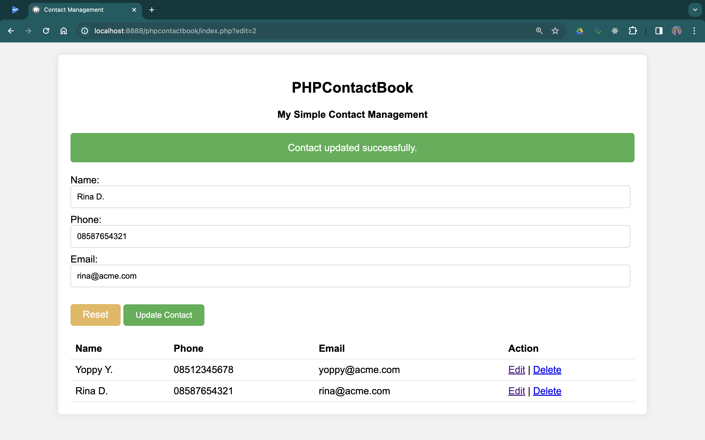

# PHPContactBook
 Simple contact management made with PHP

## Screenshot



## Installation
1. Clone the repository or download the zip file.
2. Extract the files to your server.
3. Execute `data.sql` in your database to create the necessary table.
4. Edit `index.php`, at the top of the file, to set your database credentials.

## Database settings
```php
// Database connection
$servername = "localhost:8889";
$username = "root";
$password = "root";
$dbname = "contacts_db";
```

## Usage
1. Open your browser and navigate to the folder where you extracted the files.
2. You should see the contact list.
3. You can add, edit and delete contacts.

## License
This project is licensed under the MIT License.
